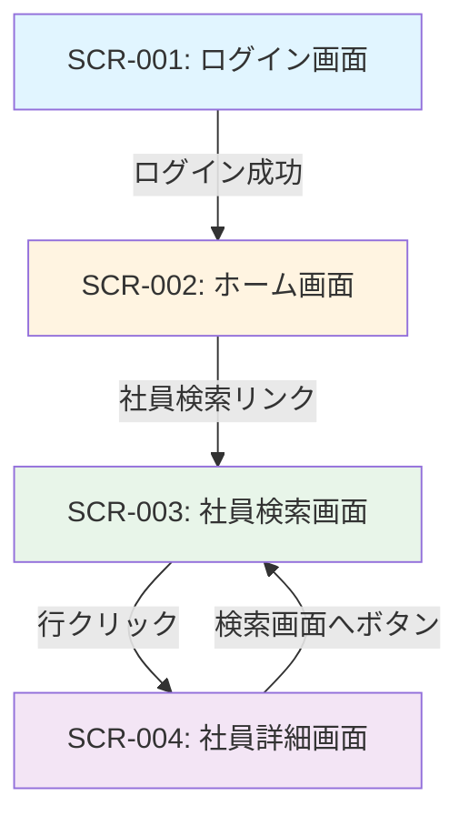

# タレントマネジメントシステム（MVP）仕様書

**Version**: 1.0.0  
**Created**: 2025-11-14  
**Updated**: 2025-11-16  
**Status**: Approved

## 1. 目的

社員の基本情報を検索・閲覧し、人事が社員情報をすばやく把握できるようにする。

**MVPの範囲**: 社員の基本情報（氏名、社員コード、メールアドレス、役職、雇用区分、入社日）の検索と詳細表示のみ。スキル機能、組織機能、編集・登録・削除機能は一切実装しない。

## 2. 主な利用者

### 2.1 人事
- 社員の基本情報を検索・閲覧
- MVPでは閲覧のみ可能（編集・スキル機能・組織機能は一切実装しない）

**注**: MVPでは人事のみがシステムを利用する。マネージャーや一般社員のログインは実装しない。

## 3. ユースケース一覧

### UC-001: ログイン
- **アクター**: 人事
- **概要**: システムにログインし、認証を受ける
- **認証方式**: セッションベース認証（ID/パスワード方式）
- **セッション有効期限**: 30分（無操作時の自動ログアウト）
- **ログイン失敗時**:
  - エラーメッセージ: "ユーザーIDまたはパスワードが正しくありません。"
  - アカウントロック機能: 実装しない
  - 失敗回数制限: なし
- **セッションタイムアウト時**:
  - ログイン画面に自動遷移
  - ログイン画面上部に表示: "セッションがタイムアウトしました。再度ログインしてください。"
- **フロー**:
  1. ユーザーがログイン画面でID/パスワードを入力
  2. システムが認証を実行
  3. 成功時、セッションを作成しホーム画面へ遷移
  4. 失敗時、同じ画面にエラーメッセージを表示
  5. 30分間無操作の場合、自動的にログアウト

### UC-002: 社員情報検索
- **アクター**: 人事
- **概要**: 条件を指定して社員を検索する
- **検索仕様**:
  - **氏名検索**: 
    - 氏名は単一フィールド（半角スペース区切り）で検索
    - 部分一致検索（前方・中間・後方一致すべて許可）
    - 例: "John Smith" に対して "John"、"Smith"、"hn Sm" すべてヒット
  - **カナ検索**:
    - 半角カタカナのみ許可（全角カタカナ・ひらがな・ローマ字は不可）
    - 半角スペース区切り
    - 部分一致検索
    - 例: "ﾀﾅｶ ﾀﾛｳ" に対して "ﾀﾅｶ"、"ﾀﾛｳ"、"ﾅｶ ﾀ" すべてヒット
  - **その他の検索項目**: すべて部分一致検索
    - 社員コード、メールアドレス、役職
  - **複数条件の組み合わせ**: AND検索（すべての条件を満たす社員を検索）
  - **完全一致検索**: MVPではサポートしない
  - **検索条件の必須性**: すべて任意（何も入力せずに検索した場合は全社員を表示）
  - **空白文字の扱い**: 空白文字のみを入力した場合は、その条件を無視
  - **検索結果の上限**: 先頭1000件のみを表示（警告メッセージなし）
  - **0件時のメッセージ**: 「該当する社員が見つかりませんでした。」
  - **削除済み社員**: 検索結果から自動的に除外
- **フロー**:
  1. 検索画面で条件を入力（氏名、氏名カナ、社員コード、メールアドレス、役職）
  2. 検索実行
  3. 検索結果一覧を表示（1ページ20件）
  4. 社員を選択して詳細画面へ遷移

### UC-003: 社員情報詳細閲覧
- **アクター**: 人事
- **概要**: 社員の詳細情報を閲覧する
- **表示項目**:
  - 基本情報（氏名、氏名カナ、社員コード、メールアドレス、役職、雇用区分、入社日）
- **フロー**:
  1. 検索結果一覧から社員を選択（行全体をクリック）
  2. 社員詳細画面を表示
  3. 基本情報を閲覧
  4. 「検索画面へ」ボタンで検索画面に戻る（検索条件はクリア）
- **注**: 編集ボタンは実装しない（閲覧のみ）

## 4. 画面・API概要

### 4.1 画面一覧

#### 画面遷移図

**画面遷移の説明**:
- ログイン後、ホーム画面に遷移
- ホーム画面から社員検索画面へ遷移（メニューのリンク）
- 検索結果の行全体をクリックで社員詳細画面へ遷移
- 詳細画面から「検索画面へ」ボタンで検索画面に戻る（検索条件はクリア）
- **注**: 編集機能は実装しないため、編集画面への遷移はなし

#### 画面一覧

#### SCR-001: ログイン画面
- **項目**: 
  - ユーザーID（テキスト入力）
  - パスワード（パスワード入力）
  - エラーメッセージ表示エリア（画面上部、エラー時のみ表示）
- **操作**: ログインボタン
- **バリデーション**: 
  - ユーザーID、パスワードともに必須
  - 空の場合: "ユーザーIDとパスワードを入力してください。"

#### SCR-002: ホーム画面
- **項目**: 
  - システム名表示: "タレントマネジメントシステム"
  - ログインユーザー名表示: "ユーザー名: {username}"
  - メニュー: 「社員検索」リンク
  - ログアウトボタン
- **操作**: 
  - 社員検索画面への遷移
  - ログアウト: ログイン画面に遷移、メッセージ表示 "ログアウトしました。"（青色背景）
- **注**: ホーム画面からのみ各機能へ遷移する（常時表示のナビゲーションバーは実装しない）

#### SCR-003: 社員検索画面
- **項目**: 
  - 検索条件（すべてテキスト入力、任意）:
    - 氏名
    - 氏名カナ
    - 社員コード
    - メールアドレス
    - 役職
  - 検索ボタン
  - 検索結果一覧（テーブル形式）:
    - 列: 氏名、社員コード、メールアドレス、役職
    - 行クリックで詳細画面へ遷移
  - 検索結果0件時: "該当する社員が見つかりませんでした。"（テーブルの代わりに表示）
  - ページネーション:
    - 「前へ」ボタン（1ページ目では非活性）
    - ページ番号リンク:
      - 総ページ3以下: すべて表示（例: 1 [2] 3）
      - 1〜2ページ目: 最大5ページ表示（例: 1 2 [3] 4 5）
      - 最終2ページ: 後ろから5ページ表示（例: 6 7 [8] 9 10）
      - 現在ページは角括弧で表示
    - 「次へ」ボタン（最終ページでは非活性）
  - ソート: 氏名の昇順のみ（固定、UI上の表示なし）
- **初期表示**: 検索結果なし（検索ボタンを押すまで空）
- **検索方式**: すべての項目で部分一致検索、複数条件はAND検索
- **バリデーション**: なし（すべて任意、空白のみの入力は無視）
- **操作**: 
  - 検索実行
  - 検索結果の行全体をクリックして詳細画面へ遷移
  - ページ移動
  - ホーム画面へ戻る（「ホームへ」リンク）
- **遷移元**: ホーム画面
- **注**: 新規登録ボタンは実装しない（新規登録機能はMVP対象外）

#### SCR-004: 社員詳細画面
- **項目**:
  - 基本情報（ラベル: 値の形式で表示）:
    - 氏名
    - 氏名カナ
    - 社員コード
    - メールアドレス
    - 役職（未設定の場合: "-"）
    - 雇用区分
    - 入社日（YYYY年MM月DD日形式）
- **操作**: 
  - 「検索画面へ」ボタン: 検索画面へ戻る（検索条件・検索結果ともに完全にクリア、初期状態に戻る）
  - 「ホームへ」リンク: ホーム画面へ戻る
- **遷移元**: 社員検索画面（検索結果の行クリック）
- **注**: 編集ボタンは実装しない（閲覧のみ）

### 4.2 主要API一覧

#### 認証API
- `POST /api/auth/login` - ログイン
- `POST /api/auth/logout` - ログアウト

#### 社員API
- `GET /api/employees` - 社員一覧取得（検索条件付き）
  - クエリパラメータ: 
    - page（ページ番号）
    - size（固定20件）
    - sort（氏名昇順固定）
    - name（氏名、部分一致）
    - nameKana（氏名カナ、部分一致）
    - employeeCode（社員コード、部分一致）
    - email（メールアドレス、部分一致）
    - position（役職、部分一致）
- `GET /api/employees/{id}` - 社員詳細取得

**注**: 更新・削除APIはMVPでは実装しない（参照のみ）

## 5. データモデル概要

### 5.0 MVP仕様確定事項

以下の仕様は、MVP開発における明確な前提として確定している：

#### 利用者
- **ログイン可能**: 人事のみ
- **マネージャー・一般社員**: ログイン不要（MVPでは実装しない）

#### 機能範囲
- **実装する機能**: 社員の基本情報（氏名、氏名カナ、社員コード、メールアドレス、役職、雇用区分、入社日）の検索と詳細表示のみ
- **実装しない機能**: 編集、登録、削除、スキル機能、組織機能

#### 認証・セキュリティ
- **認証方式**: セッションベース認証（ID/パスワード方式）
- **セッション有効期限**: 30分（無操作時の自動ログアウト）
- **パスワードポリシー**: 最小8文字以上
- **パスワードハッシュ**: BCrypt推奨

#### UI仕様
- **ページング**: 1ページ20件固定
- **ページネーション**: 番号指定方式（前へ/次へボタン + ページ番号リンク）
- **ソート**: 社員一覧は氏名の昇順のみ（固定）
- **表示件数変更**: 実装しない

#### 検索仕様
- **氏名フィールド**: 
  - 姓名を分割せず、半角スペース区切りの単一フィールド（full_name）
  - 外国籍社員を考慮した設計
  - 例: "John Smith"、"田中 太郎"
- **カナフィールド**:
  - 半角カタカナ、半角スペース区切りの単一フィールド（full_name_kana）
  - 例: "ﾀﾅｶ ﾀﾛｳ"
- **検索方式**:
  - すべての検索項目で部分一致検索を採用
  - 複数条件はAND検索
  - 完全一致検索はサポートしない
- **カナ検索ルール**:
  - 半角カタカナのみ許可
  - 全角カタカナ、ひらがな、ローマ字は不可
- **検索結果**:
  - 先頭1000件のみを表示（警告メッセージなし）
  - 0件時: 「該当する社員が見つかりませんでした。」
  - 削除済み社員は自動的に除外

#### 画面遷移
- **ホーム画面**: メニューのみ表示、ボタン/リンクで各機能へ遷移
- **ナビゲーション**: ホーム画面からのみ遷移（常時表示のナビゲーションバーは実装しない）
- **検索結果から詳細**: 行全体をクリックで遷移
- **詳細から検索**: 「検索画面へ」ボタンで戻る（検索条件はクリア）

#### エラー処理
- **バリデーションエラー**: 
  - 同じ画面に留まり、エラーメッセージを画面上部に表示
  - 複数エラーがある場合、すべて箇条書きで表示
  - 赤色の背景で目立たせる
- **システムエラー**: 
  - エラー画面に遷移
  - 表示内容: "システムエラーが発生しました。しばらくしてから再度お試しください。"
  - 「ホームへ戻る」ボタンを表示
- **セッションタイムアウト**: 
  - ログイン画面に自動遷移
  - メッセージ表示: "セッションがタイムアウトしました。再度ログインしてください。"（画面上部、青色背景）

#### MVP対象外機能
- 一般社員のログイン
- マネージャーのログイン
- 社員の新規登録機能
- 社員情報の編集機能
- 社員情報の削除機能
- スキルに関する一切の機能（検索、表示、登録、編集、削除）
- 組織に関する一切の機能（検索、表示、登録、編集、削除）
- スキルマスタ管理
- 組織マスタ管理

## 5. データモデル概要

### 5.1 社員（Employee）
- **主キー**: employee_id
- **属性**:
  - employee_code (社員コード) ※必須、英数字、最大20文字、ユニーク
  - full_name (氏名) ※必須、半角スペース区切りの単一フィールド、最大100文字（例: "John Smith"、"田中 太郎"）
  - full_name_kana (氏名カナ) ※必須、半角カタカナ、半角スペース区切り、最大100文字（例: "ﾀﾅｶ ﾀﾛｳ"）
  - email (メールアドレス) ※必須、@を含む簡易チェック、最大100文字、ユニーク
  - position (役職) ※任意、テキスト自由入力、最大50文字
  - employment_type (雇用区分) ※必須、固定値（"正社員", "契約社員", "派遣社員", "パート", "アルバイト"）
  - hire_date (入社日) ※必須、日付形式（YYYY-MM-DD）
  - deleted_at (削除日時) ※論理削除用、NULL=有効
  - created_at, updated_at
- **氏名フィールドの設計方針**:
  - 外国籍社員を考慮し、姓名を分割しない
  - 氏名は半角スペースで区切った単一フィールドとする
  - カナは半角カタカナ、半角スペース区切りの単一フィールドとする
- **注**: MVPでは組織ID（organization_id）は使用しない

### 5.2 ユーザー（User）
- **主キー**: user_id
- **属性**:
  - username (ユーザー名)
  - password_hash (パスワードハッシュ)
  - employee_id (社員ID) ※外部キー
  - created_at, updated_at

### 5.3 MVP対象外のデータモデル
以下のデータモデルはMVPでは実装しない：
- スキルマスタ（Skill）
- 社員スキル（EmployeeSkill）
- 組織（Organization）

## 6. 非機能要件（MVP最低限）

### 6.1 パフォーマンス
- 社員検索: 1000件以下の結果を3秒以内に表示
- 画面遷移: 通常操作で2秒以内に応答

### 6.2 セキュリティ
- 認証方式: セッションベース認証（ID/パスワード方式）
- セッション有効期限: 30分（無操作時の自動ログアウト）
- パスワードポリシー: 最小8文字以上
- パスワードはハッシュ化して保存（BCrypt推奨）
- HTTPS通信を使用
- セッション管理による認証状態の維持

### 6.3 可用性
- 営業時間内（平日9:00-18:00）の稼働を想定
- ダウンタイムは計画メンテナンス時のみ

### 6.4 データ整合性
- 外部キー制約による参照整合性の保証
- トランザクション管理による更新の原子性

### 6.5 ユーザビリティ
- レスポンシブデザイン（PC/タブレット対応）
- 直感的なナビゲーション
- エラーメッセージの明確な表示

## 7. MVP対象外機能

以下の機能はMVPでは実装しない：

### 7.1 社員情報管理機能
- 社員の新規登録機能
- 社員情報の編集機能
- 社員情報の削除機能

### 7.2 スキル管理機能
- スキル情報の登録・編集・削除機能
- スキル検索機能
- スキルマスタ管理（登録・編集・削除）

### 7.3 組織管理機能
- 組織情報の検索・表示機能
- 組織ツリー閲覧機能
- 組織情報管理（登録・編集・削除）

### 7.4 詳細な権限管理
- ロールごとの細かい閲覧制御
- 項目レベルのアクセス制御
- データスコープによる制限

### 7.5 詳細な監査ログ
- 画面単位・項目単位の操作履歴
- 変更前後の値の記録
- ログの検索・分析機能

### 7.6 高度なスキル分析
- スキルマップ自動生成
- スキルギャップ分析
- スキルトレンド分析
- レコメンデーション機能

### 7.7 組織改編の履歴管理
- 組織変更のタイムライン管理
- 過去時点の組織構造の再現
- 異動履歴の追跡

### 7.8 外部システム連携
- 人事給与システムとの自動連携
- Active Directoryとの統合
- SSOによる認証
- データインポート/エクスポート機能

### 7.9 その他
- マネージャーのログイン機能
- 一般社員のログイン機能
- 社員本人による情報編集機能
- 常時表示のナビゲーションバー
- 多言語対応
- 通知機能（メール/プッシュ通知）
- ワークフロー機能（承認プロセス）
- レポート出力機能
- モバイルアプリ
- 削除データの復元機能
- パスワードリセット機能
- 複数段階のソート機能
- 表示件数の変更機能

## 8. 技術スタック

### 8.1 バックエンド
- Java 17
- Spring Boot 3
- Spring Data JPA
- MySQL 8.0

### 8.2 フロントエンド
- React 18
- TypeScript
- React Router
- Axios

### 8.3 開発・運用
- Spec-Kit（仕様管理）
- Amazon Q Developer（開発支援）
- Git（バージョン管理）

## 9. 制約事項

### 9.1 データ制約
- 氏名フィールド:
  - 姓名を分割せず、半角スペース区切りの単一フィールド
  - 外国籍社員を考慮した設計
- カナフィールド:
  - 半角カタカナのみ許可
  - 半角スペース区切りの単一フィールド
- MVPでは組織・スキルのデータモデルは使用しない
- **データベース命名規則**:
  - テーブル名: スネークケース、単数形（例: `employee`, `user`）
  - カラム名: スネークケース（例: `employee_code`, `full_name`, `full_name_kana`）

### 9.2 機能制約
- 認証はセッションベース（ID/パスワード方式）
- セッション有効期限は30分
- ログイン可能: 人事のみ
- マネージャー・一般社員のログインは実装しない
- 社員の新規登録機能は実装しない
- 社員情報の編集機能は実装しない
- スキルに関する一切の機能は実装しない
- 組織に関する一切の機能は実装しない
- 常時表示のナビゲーションバーは実装しない（ホーム画面からのみ遷移）

### 9.3 削除制約
- 社員のみ論理削除（deleted_atフィールドを使用）
- 削除データの復元機能は実装しない
- 削除されたデータは一覧・検索結果に表示しない
- MVPでは削除機能自体を実装しない（将来の拡張用にdeleted_atフィールドのみ定義）

### 9.4 UI制約
- 一覧画面のページング: 1ページ20件固定
- ページネーション方式: 番号指定方式
- ソート: 社員一覧は氏名の昇順のみ（固定）
- 検索結果の最大件数: 制限なし（ただし、パフォーマンス要件として1000件以下を想定）

### 9.5 運用制約
- 初期データ:
  - ユーザーデータ: 1件（username: "admin", password: "password123"）
  - 社員データ: 10件程度のテストデータを用意
  - すべて手動登録（SQLスクリプトで投入）
- バックアップは日次で実施
- システムメンテナンスは営業時間外に実施

## 10. 今後の拡張性

MVPの成功後、以下の機能拡張を検討：

- 詳細な権限管理とデータスコープ
- 監査ログと変更履歴の追跡
- スキル分析とレコメンデーション
- 組織改編履歴の管理
- 外部システムとの連携
- ワークフロー機能
- レポート・ダッシュボード機能
