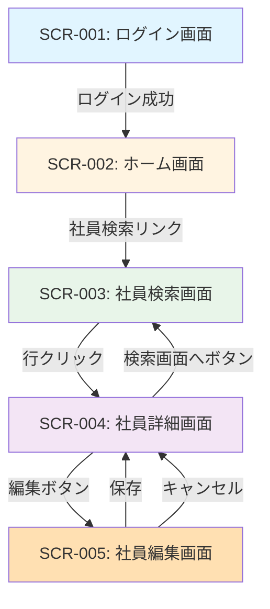

# タレントマネジメントシステム（MVP）仕様書

**Version**: 1.7.0  
**Created**: 2025-11-14  
**Updated**: 2025-11-14  
**Status**: Draft

## 1. 目的

社員情報・スキル情報・組織情報を検索・閲覧し、人事が「誰がどのスキルを持ち、どの組織に所属しているか」をすばやく把握できるようにする。配置最適化や要員検討のための基盤となるデータを参照することを目的とする。

**MVPの範囲**: 社員情報の検索と閲覧のみ。編集・登録・削除機能は実装しない。

## 2. 主な利用者

### 2.1 人事
- 全社の社員・スキル・組織情報を検索・閲覧
- 配置検討や採用計画のインプットに利用
- MVPでは閲覧のみ可能（編集機能は実装しない）

**注**: MVPでは人事のみがシステムを利用する。マネージャーや一般社員のログインは実装しない。

## 3. ユースケース一覧

### UC-001: ログイン
- **アクター**: 人事
- **概要**: システムにログインし、認証を受ける
- **認証方式**: セッションベース認証（ID/パスワード方式）
- **セッション有効期限**: 30分（無操作時の自動ログアウト）
- **フロー**:
  1. ユーザーがログイン画面でID/パスワードを入力
  2. システムが認証を実行
  3. 成功時、セッションを作成しホーム画面へ遷移
  4. 30分間無操作の場合、自動的にログアウト

### UC-002: 社員情報検索
- **アクター**: 人事
- **概要**: 条件を指定して社員を検索する
- **検索仕様**:
  - **氏名検索**: 
    - 氏名は単一フィールド（半角スペース区切り）で検索
    - 部分一致検索（前方・中間・後方一致すべて許可）
    - 例: "John Smith" に対して "John"、"Smith"、"hn Sm" すべてヒット
  - **カナ検索**:
    - 半角カタカナのみ許可（全角カタカナ・ひらがな・ローマ字は不可）
    - 半角スペース区切り
    - 部分一致検索
    - 例: "ﾀﾅｶ ﾀﾛｳ" に対して "ﾀﾅｶ"、"ﾀﾛｳ"、"ﾅｶ ﾀ" すべてヒット
  - **スキル検索**:
    - スキルマスタから複数選択可能
    - 複数スキル選択時はAND検索（すべてのスキルを持つ社員を検索）
    - スキルレベル（1=基礎、2=中級、3=上級）も検索条件に含められる
    - スキルレベルはプルダウンで選択
    - 例: 「Java（レベル2以上）」と「AWS（レベル指定なし）」を選択した場合、Javaを中級以上で持ち、かつAWSを持つ社員を検索
  - **その他の検索項目**: すべて部分一致検索
    - 社員コード、メールアドレス、組織名、役職
  - **複数条件の組み合わせ**: AND検索（すべての条件を満たす社員を検索）
  - **完全一致検索**: MVPではサポートしない
  - **検索条件の必須性**: すべて任意（何も入力せずに検索した場合は全社員を表示）
  - **空白文字の扱い**: 空白文字のみを入力した場合は、その条件を無視
  - **検索結果の上限**: 先頭1000件のみを表示（警告メッセージなし）
  - **0件時のメッセージ**: 「該当する社員が見つかりませんでした。」
  - **削除済み社員**: 検索結果から自動的に除外
- **フロー**:
  1. 検索画面で条件を入力（氏名、社員コード、所属組織、役職、スキル、スキルレベルなど）
  2. 検索実行
  3. 検索結果一覧を表示（顔写真付き、1ページ20件）
  4. 社員を選択して詳細画面へ遷移

### UC-003: 社員情報詳細閲覧
- **アクター**: 人事
- **概要**: 社員の詳細情報を閲覧する
- **フロー**:
  1. 社員詳細画面を表示
  2. 基本情報、顔写真、保有スキル、所属組織を表示

### UC-004: 社員情報編集
- **アクター**: 人事
- **概要**: 社員の基本情報を編集する
- **編集権限**:
  - 人事: すべての基本情報を編集可能
  - 承認フローは実装しない（即座に反映）
- **入力項目**:
  - 氏名（半角スペース区切り、例: "田中 太郎"）
  - 氏名カナ（半角カタカナ、半角スペース区切り、例: "ﾀﾅｶ ﾀﾛｳ"）
  - 社員コード、メールアドレス、所属組織、役職、雇用区分、入社日
  - 保有スキル（スキル選択、レベル設定）
- **フロー**:
  1. 社員詳細画面から「編集」ボタンをクリック
  2. 社員編集画面を表示
  3. 基本情報とスキル情報を編集
  4. 保存実行（即座に反映）
  5. 社員詳細画面に戻る
- **キャンセル時**: 社員詳細画面に戻る（変更は破棄）
- **注**: 社員の新規登録機能、顔写真アップロード機能はMVPでは実装しない

### UC-005: スキル検索
- **アクター**: 人事
- **概要**: 特定スキルを持つ社員を検索する
- **検索方式**: 社員検索画面（SCR-003）のスキル検索条件を使用
- **フロー**:
  1. 社員検索画面でスキルを検索条件として指定
  2. 検索実行
  3. 該当社員一覧を表示（顔写真付き、1ページ20件）
  4. 社員を選択して詳細画面へ遷移（行全体をクリック）

## 4. 画面・API概要

### 4.1 画面一覧

#### 画面遷移図

**画面遷移の説明**:
- ログイン後、ホーム画面に遷移
- ホーム画面から社員検索画面へ遷移（メニューのリンク）
- 検索結果の行全体をクリックで社員詳細画面へ遷移
- 詳細画面から「編集」ボタンで編集画面へ遷移
- 編集画面から「保存」または「キャンセル」で詳細画面に戻る
- 詳細画面から「検索画面へ」ボタンで検索画面に戻る（検索条件はクリア）

#### 画面一覧

#### SCR-001: ログイン画面
- **項目**: ユーザーID、パスワード
- **操作**: ログインボタン

#### SCR-002: ホーム画面
- **項目**: 
  - メニュー（社員検索へのリンク）
- **操作**: 社員検索画面への遷移
- **注**: ホーム画面からのみ各機能へ遷移する（常時表示のナビゲーションバーは実装しない）

#### SCR-003: 社員検索画面
- **項目**: 
  - 検索条件（氏名、氏名カナ、社員コード、所属組織、役職、スキル、スキルレベル）
  - スキル検索: 複数選択可能、各スキルにレベル指定可能（プルダウン: 指定なし/基礎以上/中級以上/上級のみ）
  - 検索結果一覧（顔写真、氏名、社員コード、所属組織、役職）
  - ページネーション（1ページ20件、番号指定方式）
  - ソート（氏名の昇順のみ、デフォルト）
- **検索方式**: すべての項目で部分一致検索、複数条件はAND検索
- **操作**: 
  - 検索実行
  - 検索結果の行全体をクリックして詳細画面へ遷移
  - ページ移動
- **遷移元**: ホーム画面
- **注**: 新規登録ボタンは実装しない（新規登録機能はMVP対象外）

#### SCR-004: 社員詳細画面
- **項目**:
  - 基本情報（氏名、氏名カナ、社員コード、所属組織、役職、雇用区分、入社日、メールアドレス）
  - 顔写真
  - 保有スキル一覧（スキル名、カテゴリ、レベル）
  - 所属組織情報
- **操作**: 
  - 「編集」ボタンをクリックして編集画面へ遷移
  - 「検索画面へ」ボタンをクリックして検索画面へ戻る（検索条件はクリア）
- **遷移元**: 社員検索画面（検索結果の行クリック）

#### SCR-005: 社員編集画面
- **項目**: 
  - 氏名（半角スペース区切り）
  - 氏名カナ（半角カタカナ、半角スペース区切り）
  - 社員コード、メールアドレス、所属組織、役職、雇用区分、入社日
  - スキル編集エリア:
    - 保有スキル一覧（スキル名、カテゴリ、レベル）
    - スキル追加（ドロップダウンでスキル選択、レベル選択1-3）
    - スキル削除（各スキルの削除ボタン）
- **操作**: 
  - 「保存」ボタンをクリックして保存し、社員詳細画面に戻る
  - 「キャンセル」ボタンをクリックして社員詳細画面に戻る（変更は破棄）
- **遷移元**: 社員詳細画面（「編集」ボタンクリック）
- **注**: 新規登録機能、顔写真アップロード機能は実装しない

### 4.2 主要API一覧

#### 認証API
- `POST /api/auth/login` - ログイン
- `POST /api/auth/logout` - ログアウト

#### 社員API
- `GET /api/employees` - 社員一覧取得（検索条件付き）
  - クエリパラメータ: 
    - page（ページ番号）
    - size（固定20件）
    - sort（氏名昇順固定）
    - name（氏名、部分一致）
    - nameKana（氏名カナ、部分一致）
    - employeeCode（社員コード、部分一致）
    - organizationId（所属組織ID）
    - position（役職、部分一致）
    - skills（スキルID配列、AND検索）
    - skillLevels（スキルレベル配列、各スキルに対応）
- `GET /api/employees/{id}` - 社員詳細取得
- `PUT /api/employees/{id}` - 社員更新
- `DELETE /api/employees/{id}` - 社員削除（論理削除）

#### スキルAPI
- `GET /api/skills` - スキルマスタ一覧取得
- `GET /api/employees/{id}/skills` - 社員の保有スキル取得
- `POST /api/employees/{id}/skills` - 社員スキル登録
- `DELETE /api/employees/{id}/skills/{skillId}` - 社員スキル削除（論理削除）

#### 組織API
- `GET /api/organizations` - 組織一覧取得
- `GET /api/organizations/{id}` - 組織詳細取得

## 5. データモデル概要

### 5.0 MVP仕様確定事項

以下の仕様は、MVP開発における明確な前提として確定している：

#### 利用者
- **ログイン可能**: 人事のみ
- **マネージャー・一般社員**: ログイン不要（MVPでは実装しない）

#### 認証・セキュリティ
- **認証方式**: セッションベース認証（ID/パスワード方式）
- **セッション有効期限**: 30分（無操作時の自動ログアウト）
- **パスワードポリシー**: 最小8文字以上
- **パスワードハッシュ**: BCrypt推奨

#### 編集権限
- **人事**: すべての社員情報・スキル情報を編集可能
- **承認フロー**: 実装しない（すべての編集は即座に反映）

#### 削除方式
- **論理削除**: 社員、社員スキルのみ論理削除
- **削除フィールド**: deleted_at（NULL=有効、日時=削除済み）
- **復元機能**: 実装しない
- **組織・スキルマスタ**: 削除機能は実装しない（参照のみ）

#### UI仕様
- **ページング**: 1ページ20件固定
- **ページネーション**: 番号指定方式
- **ソート**: 社員一覧は氏名の昇順のみ（固定）
- **表示件数変更**: 実装しない

#### スキルレベル
- **レベル定義**: 3段階固定
  - 1 = 基礎（学習中、基本的な知識がある）
  - 2 = 中級（実務経験あり、独力で作業可能）
  - 3 = 上級（専門家レベル、指導可能）
- **判定方法**: 人事が設定
- **将来拡張**: 考慮しない（YAGNIの原則）

#### 検索仕様
- **氏名フィールド**: 
  - 姓名を分割せず、半角スペース区切りの単一フィールド（full_name）
  - 外国籍社員を考慮した設計
  - 例: "John Smith"、"田中 太郎"
- **カナフィールド**:
  - 半角カタカナ、半角スペース区切りの単一フィールド（full_name_kana）
  - 例: "ﾀﾅｶ ﾀﾛｳ"
- **検索方式**:
  - すべての検索項目で部分一致検索を採用
  - 複数条件はAND検索
  - 完全一致検索はサポートしない
- **スキル検索**:
  - 複数スキル選択可能（AND検索）
  - スキルレベル（1=基礎、2=中級、3=上級）も検索条件に含められる
  - スキルレベルはプルダウンで選択（指定なし/基礎以上/中級以上/上級のみ）
- **カナ検索ルール**:
  - 半角カタカナのみ許可
  - 全角カタカナ、ひらがな、ローマ字は不可
- **検索結果**:
  - 先頭1000件のみを表示（警告メッセージなし）
  - 0件時: 「該当する社員が見つかりませんでした。」
  - 削除済み社員は自動的に除外

#### 画面遷移
- **ホーム画面**: メニューのみ表示、ボタン/リンクで各機能へ遷移
- **ナビゲーション**: ホーム画面からのみ遷移（常時表示のナビゲーションバーは実装しない）
- **検索結果から詳細**: 行全体をクリックで遷移
- **詳細から検索**: 「検索画面へ」ボタンで戻る（検索条件はクリア）
- **詳細から編集**: 「編集」ボタンで編集画面へ遷移
- **編集後**: 保存後は社員詳細画面に戻る
- **キャンセル時**: 社員詳細画面に戻る（変更は破棄）

#### エラー処理
- **バリデーションエラー**: 同じ画面に留まり、エラーメッセージを表示
- **システムエラー**: エラー画面に遷移
- **セッションタイムアウト**: ログイン画面に自動遷移（メッセージ表示）

#### MVP対象外機能
- 一般社員のログイン
- マネージャーのログイン
- 社員の新規登録機能
- 顔写真アップロード機能
- 顔写真表示機能
- 組織ツリー閲覧機能
- 組織情報管理（登録・編集・削除）
- スキルマスタ管理（登録・編集・削除）

## 5. データモデル概要

### 5.1 社員（Employee）
- **主キー**: employee_id
- **属性**:
  - employee_code (社員コード)
  - full_name (氏名) ※半角スペース区切りの単一フィールド（例: "John Smith"、"田中 太郎"）
  - full_name_kana (氏名カナ) ※半角カタカナ、半角スペース区切り（例: "ﾀﾅｶ ﾀﾛｳ"）
  - email (メールアドレス)
  - organization_id (所属組織ID) ※外部キー
  - position (役職)
  - employment_type (雇用区分)
  - hire_date (入社日)
  - deleted_at (削除日時) ※論理削除用、NULL=有効
  - created_at, updated_at
- **氏名フィールドの設計方針**:
  - 外国籍社員を考慮し、姓名を分割しない
  - 氏名は半角スペースで区切った単一フィールドとする
  - カナは半角カタカナ、半角スペース区切りの単一フィールドとする
- **注**: 顔写真フィールドはMVPでは実装しない

### 5.2 スキルマスタ（Skill）
- **主キー**: skill_id
- **属性**:
  - skill_name (スキル名)
  - skill_category (カテゴリ: 技術/ビジネス/言語など)
  - description (説明)
  - created_at, updated_at
- **注**: MVPではスキルマスタの登録・編集・削除機能は実装しない（参照のみ）

### 5.3 社員スキル（EmployeeSkill）
- **主キー**: employee_skill_id
- **属性**:
  - employee_id (社員ID) ※外部キー
  - skill_id (スキルID) ※外部キー
  - skill_level (レベル: 1=基礎/2=中級/3=上級)
  - acquired_date (取得日)
  - deleted_at (削除日時) ※論理削除用、NULL=有効
  - created_at, updated_at

### 5.4 組織（Organization）
- **主キー**: organization_id
- **属性**:
  - organization_code (組織コード)
  - organization_name (組織名)
  - parent_organization_id (親組織ID) ※外部キー（自己参照）
  - organization_level (階層レベル)
  - created_at, updated_at
- **注**: MVPでは組織の登録・編集・削除機能は実装しない（参照のみ）

### 5.5 ユーザー（User）
- **主キー**: user_id
- **属性**:
  - username (ユーザー名)
  - password_hash (パスワードハッシュ)
  - employee_id (社員ID) ※外部キー
  - created_at, updated_at

## 6. 非機能要件（MVP最低限）

### 6.1 パフォーマンス
- 社員検索: 1000件以下の結果を3秒以内に表示
- 画面遷移: 通常操作で2秒以内に応答

### 6.2 セキュリティ
- 認証方式: セッションベース認証（ID/パスワード方式）
- セッション有効期限: 30分（無操作時の自動ログアウト）
- パスワードポリシー: 最小8文字以上
- パスワードはハッシュ化して保存（BCrypt推奨）
- HTTPS通信を使用
- セッション管理による認証状態の維持

### 6.3 可用性
- 営業時間内（平日9:00-18:00）の稼働を想定
- ダウンタイムは計画メンテナンス時のみ

### 6.4 データ整合性
- 外部キー制約による参照整合性の保証
- トランザクション管理による更新の原子性

### 6.5 ユーザビリティ
- レスポンシブデザイン（PC/タブレット対応）
- 直感的なナビゲーション
- エラーメッセージの明確な表示

## 7. MVP対象外機能

以下の機能はMVPでは実装しない：

### 7.1 詳細な権限管理
- ロールごとの細かい閲覧制御
- 項目レベルのアクセス制御
- データスコープによる制限

### 7.2 詳細な監査ログ
- 画面単位・項目単位の操作履歴
- 変更前後の値の記録
- ログの検索・分析機能

### 7.3 高度なスキル分析
- スキルマップ自動生成
- スキルギャップ分析
- スキルトレンド分析
- レコメンデーション機能

### 7.4 組織改編の履歴管理
- 組織変更のタイムライン管理
- 過去時点の組織構造の再現
- 異動履歴の追跡

### 7.5 外部システム連携
- 人事給与システムとの自動連携
- Active Directoryとの統合
- SSOによる認証
- データインポート/エクスポート機能

### 7.6 その他
- マネージャーのログイン機能
- 一般社員のログイン機能
- 社員本人による情報編集機能
- 社員の新規登録機能
- 組織ツリー閲覧機能
- 組織情報管理（登録・編集・削除）
- スキルマスタ管理（登録・編集・削除）
- 顔写真の削除機能（更新のみ可能）
- 常時表示のナビゲーションバー
- 多言語対応
- 通知機能（メール/プッシュ通知）
- ワークフロー機能（承認プロセス）
- レポート出力機能
- モバイルアプリ
- 削除データの復元機能
- パスワードリセット機能
- 複数段階のソート機能
- 表示件数の変更機能
- 画像のリサイズ・サムネイル生成

## 8. 技術スタック

### 8.1 バックエンド
- Java 17
- Spring Boot 3
- Spring Data JPA
- MySQL 8.0

### 8.2 フロントエンド
- React 18
- TypeScript
- React Router
- Axios

### 8.3 開発・運用
- Spec-Kit（仕様管理）
- Amazon Q Developer（開発支援）
- Git（バージョン管理）

## 9. 制約事項

### 9.1 データ制約
- 社員は1つの組織にのみ所属
- 組織階層は単純な親子関係のみ
- スキルレベルは3段階固定（1=基礎、2=中級、3=上級）
- スキルレベルは人事が設定する
- 氏名フィールド:
  - 姓名を分割せず、半角スペース区切りの単一フィールド
  - 外国籍社員を考慮した設計
- カナフィールド:
  - 半角カタカナのみ許可
  - 半角スペース区切りの単一フィールド

### 9.2 機能制約
- 顔写真は表示のみ（検索条件に含めない）
- 顔写真は任意（未設定可）
- 顔写真はデータベースのBLOBフィールドに保存
- 認証はセッションベース（ID/パスワード方式）
- セッション有効期限は30分
- ログイン可能: 人事のみ
- マネージャー・一般社員のログインは実装しない
- 編集権限:
  - 人事: すべての社員情報とスキル情報を編集可能
- 承認フローは実装しない（即座に反映）
- 社員の新規登録機能は実装しない（編集のみ）
- スキル編集は社員編集画面内で実施（独立した画面は不要）
- 組織管理機能は実装しない（参照のみ）
- スキルマスタ管理機能は実装しない（参照のみ）
- 常時表示のナビゲーションバーは実装しない（ホーム画面からのみ遷移）

### 9.3 削除制約
- 社員と社員スキルのみ論理削除（deleted_atフィールドを使用）
- 組織とスキルマスタは削除機能を実装しない
- 削除データの復元機能は実装しない
- 削除されたデータは一覧・検索結果に表示しない

### 9.4 UI制約
- 一覧画面のページング: 1ページ20件固定
- ページネーション方式: 番号指定方式
- ソート: 社員一覧は氏名の昇順のみ（固定）
- 検索結果の最大件数: 制限なし（ただし、パフォーマンス要件として1000件以下を想定）

### 9.5 運用制約
- 初期データは手動登録
- バックアップは日次で実施
- システムメンテナンスは営業時間外に実施

## 10. 今後の拡張性

MVPの成功後、以下の機能拡張を検討：

- 詳細な権限管理とデータスコープ
- 監査ログと変更履歴の追跡
- スキル分析とレコメンデーション
- 組織改編履歴の管理
- 外部システムとの連携
- ワークフロー機能
- レポート・ダッシュボード機能
